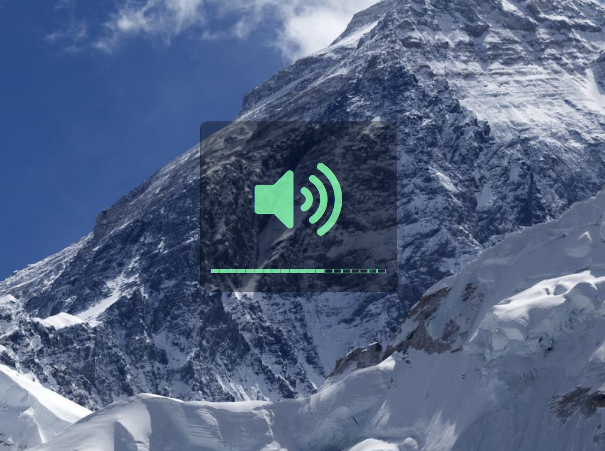

## Lemontify: OSX-inspired notifications based on lemobar

`Usage: ./lemontify -p {audio|bcklight|bright|kbdlight} [-h | -v | -i | -d | -o | -m | -t | -e | -r | -s <val> | -a text]`

| Description			| Command   |
|:--------------------- |:----------|
|-h\|--help				|Show this help|
|-v\|--verbose			|Print verbose output|
|-i\|--inc				|Increase current level|
|-d\|--dec				|Decreasse current level|
|-o\|--off				|Set current level to off|
|-m\|--max				|Set current level to max|
|-t\|--toggle			|Toggle on|off (if applicable)|
|-e\|--empty			|Print empty squares (default=false)|
|-r\|--ramp				|Ramp icon based on level (default=false)|
|-l\|--line				|Print as one line (disable multiline)|
|-s\|--step \<val\>		|Set increment|decrement step|
|-a\|--text \<val\>		|Print additonal output text|
|-p\|--provider \<val\>	|Set the current provider
|
provider:audio
	|Set audio volume|
|
provider:bcklight
	|Set screen backlight|
|
provider:bright
	|Set screen brightness (xrandr)|
|
provider:kbdlight
	|Set keyboard LEDs|

For more information see my reddit post: [here](https://www.reddit.com/r/unixporn/comments/f8mhku/lemonbar_lemontify_osxinspired_notification/) or [direct link to reddit video](https://v.redd.it/wipy5o0l4ti41/DASH_1080?source=fallback)
